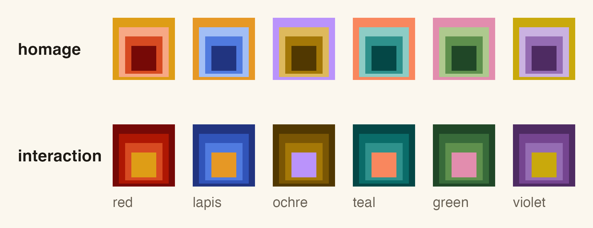

albersdown
==========

<!-- badges: start -->
[](https://github.com/bbuchsbaum/albersdown/actions/workflows/R-CMD-check.yaml)
[](https://bbuchsbaum.github.io/albersdown/)
<!-- badges: end -->

A vignette and pkgdown theme for R packages, built on Josef Albers's
*Interaction of Color*. Each vignette gets a title plate in the Homage-to-the-Square
proportions, numbered sections, a margin column for notes, legible code output,
booktabs tables, and matching ggplot2 figures, in light and dark. Vignettes stay
self-contained and CRAN-safe: fonts and scripts are embedded, and equations are
written as MathML, so nothing is fetched when the page is read.



The [documentation site](https://bbuchsbaum.github.io/albersdown/) is built
with the theme.

Vignettes
---------

In the vignette's YAML header:

```yaml
output:
  albersdown::albers_vignette:
    family: teal        # red, lapis, ochre, teal, green, violet
    preset: homage      # homage (warm, serif) or interaction (cool, grotesk)
```

and in `DESCRIPTION`:

```
Suggests:
    albersdown (>= 2.0.0.9000),
    knitr,
    rmarkdown
VignetteBuilder: knitr
Remotes: bbuchsbaum/albersdown
```

That is all. `albers_vignette()` is in the development version of albersdown
(2.0.0.9000), not yet on CRAN, hence the version bound and `Remotes`, which
make R CMD check and CI install it from GitHub (`R CMD check --as-cran` notes
the unknown `Remotes` field). A package headed for CRAN has to wait until the
release with `albers_vignette()` is on CRAN, and then declare that version,
e.g. `albersdown (>= 2.1.0)`; until then it can use the pkgdown site theme
alone (below).

If a vignette build fails with `'albers_vignette' is not an exported object
from 'namespace:albersdown'`, the albersdown being used is CRAN's 2.0.0 (R does
not enforce `Suggests` versions when building): install the development
version with `pak::pak("bbuchsbaum/albersdown")`.

The format sets knitr defaults, uses `theme_albers()` for plots while the
vignette renders, and renders a dark version of each ggplot for
readers in dark mode. Scales follow the vignette's family:

```r
ggplot(mtcars, aes(wt, mpg, colour = factor(cyl))) +
  geom_point() +
  albersdown::scale_color_albers()
```

Writing a vignette
------------------

Ordinary R Markdown, plus a few conventions the theme understands:

- **Callouts**: `::: {.callout .callout-tip}` (also `callout-note`,
  `callout-warning`, `callout-danger`) with a bold first word as the label.
- **Margin notes**: footnotes (`[^1]`) are also set in the right margin on wide
  screens.
- **Wide blocks**: wrap a chunk or table in `::: {.wide}` to use the margin
  column; `class.source = "wide"` widens one chunk's code.
- **Sections** are numbered; add `{.unnumbered}` to a heading to skip one.
- **Math** is written as MathML, so it renders offline.

Margin notes and `.wide` blocks use the margin column of the vignette layout; on
a pkgdown site, footnotes use pkgdown's own popovers.

What it adds to a vignette: about 155 KB of embedded fonts for Homage (about
130 KB for Interaction) and about 110 KB of stylesheet and script, so a vignette
with one short chunk is about 285 KB, plus a dark version of each ggplot figure
(turn that off with `dark_figures = FALSE`). The same cost lands in the package
tarball for every vignette. Plots drawn with `print(p)` or base graphics, and
plots in chunks with `fig.show = "hold"`, `"animate"` or `"hide"`, get no dark
version (they stay light in dark mode).

To start a new vignette from the template: `rmarkdown::draft("vignettes/intro.Rmd",
template = "albers_vignette", package = "albersdown")`, or *File > New File >
R Markdown > From Template > Albers Vignette* in RStudio.

pkgdown sites
-------------

In `_pkgdown.yml`:

```yaml
template:
  package: albersdown
  bootstrap: 5
```

and `Config/Needs/website: bbuchsbaum/albersdown` in `DESCRIPTION`. Neither
is read by R CMD check, so a CRAN package can theme its site this way without
changing its vignettes or dependencies. The site build does need the
development albersdown (2.0.0.9000 or later): `Config/Needs/website` makes a
pkgdown CI workflow install it from GitHub, and locally install it with
`pak::pak("bbuchsbaum/albersdown")`. With CRAN's albersdown 2.0.0 installed,
pkgdown builds a plain Bootstrap site without an error. Plots in articles
keep your own ggplot2 theme on this route. Articles
written with `albers_vignette()` keep their own family on the site. To change
the site-wide default family, re-run `use_albersdown()` with that family (it
writes `pkgdown/extra.js`), or add to `_pkgdown.yml`:

```yaml
template:
  includes:
    in_header: |
      <script>window.albersdownDefaults = { family: "lapis", preset: "interaction" };</script>
```

Plots and tables outside vignettes
----------------------------------

- `theme_albers(family, preset, mode = c("light", "dark"))` for ggplot2.
- `scale_color_albers()`, `scale_fill_albers()`: the family paired with its
  complement (`type = "family"` for a single-hue ramp); `albers_discrete()`
  returns the colours.
- `gt_albers()` for gt tables; `albers_bs_theme()` for bslib/Shiny.

Install
-------

```r
pak::pak("bbuchsbaum/albersdown")
```

Existing packages
-----------------

```r
albersdown::use_albersdown(".", family = "teal", preset = "homage")
```

switches each vignette that uses `rmarkdown::html_vignette` to
`albersdown::albers_vignette` (Quarto, bookdown, flow-style `output: {...}`
headers and vignettes whose first format is something else are reported and
left alone; articles in `vignettes/articles/` need
`output: albersdown::albers_vignette` set by hand), adds
`albersdown (>= <installed version>)` (in `Suggests`, or where albersdown is
already in `Imports`/`Depends`) and the other `Suggests` and `VignetteBuilder`
entries (plus `Remotes: bbuchsbaum/albersdown` while that version is not on
CRAN), and points `_pkgdown.yml` at the template. When no vignette ends up on
the format (none to convert, or `apply_to = "new"`), only `_pkgdown.yml` and
`Config/Needs/website` change: the site-only route. A package
set up by albersdown 2.0 is migrated (called without `family`/`preset`, the
helper keeps the family and direction the package already uses, and says
where it found them): its setup-chunk lines, `params`,
generated `pkgdown/extra.css`/`extra.js` and README note are replaced, and the
copied assets in `vignettes/` are moved out. The edits are textual (other
output formats, comments, key order and line endings are kept), each changed
file is backed up to `.albersdown.bak/` (which, with `_pkgdown.yml`, is added
to `.Rbuildignore`; `.albersdown.bak/` also goes in `.gitignore`), and
`dry_run = TRUE` shows what would change. `readme = TRUE` adds a short note
to `README.Rmd` (re-knit it) or, without one, `README.md`. `method = "vendor"` keeps the older
setup that copies the stylesheet and script into `vignettes/`.
