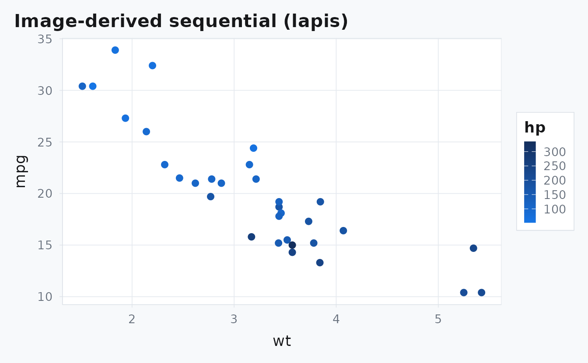
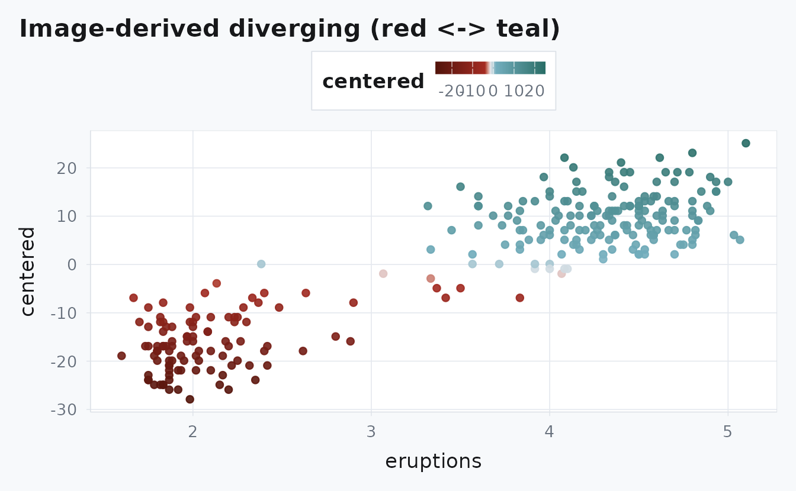
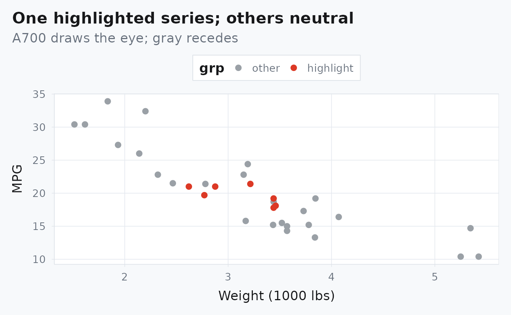

# Design notes: Homage system

## What’s new in this release

- Token-driven design system (`inst/tokens/albers-tokens.yml`) now
  controls families, presets, and dark calibrations.
- Deterministic composition blocks (`.albers-composition`) add a
  signature visual motif.
- Semantic callout variants (`callout-note`, `callout-insight`,
  `callout-warning`, `callout-experiment`) are available.
- Contrast validation now checks family/preset combinations against AA
  thresholds.

### Semantic callouts

Use `callout-note` for neutral guidance.

Use `callout-insight` for interpretation and design intent.

Use `callout-warning` when a choice has clear tradeoffs.

Use `callout-experiment` for exploratory or provisional guidance.

### Typography and syntax tone

``` r
fit <- lm(mpg ~ wt + hp, data = mtcars)
coef(summary(fit))
#>                Estimate Std. Error   t value     Pr(>|t|)
#> (Intercept) 37.22727012 1.59878754 23.284689 2.565459e-20
#> wt          -3.87783074 0.63273349 -6.128695 1.119647e-06
#> hp          -0.03177295 0.00902971 -3.518712 1.451229e-03
```

### Contrast guardrail example

``` r
contrast_ratio <- function(fg, bg) {
  to_rgb <- function(x) as.numeric(grDevices::col2rgb(x)) / 255
  to_lin <- function(u) ifelse(u <= 0.03928, u / 12.92, ((u + 0.055) / 1.055)^2.4)
  luma <- function(x) {
    rgb <- to_rgb(x); lin <- to_lin(rgb)
    0.2126 * lin[1] + 0.7152 * lin[2] + 0.0722 * lin[3]
  }
  l1 <- luma(fg); l2 <- luma(bg)
  if (l1 < l2) { tmp <- l1; l1 <- l2; l2 <- tmp }
  (l1 + 0.05) / (l2 + 0.05)
}

ratio_structural <- contrast_ratio("#C22B23", "#e6e9ed")
ratio_adobe <- contrast_ratio("#C22B23", "#ece9e7")
stopifnot(ratio_structural >= 4.5, ratio_adobe >= 4.5)

data.frame(
  context = c("structural bg", "adobe bg"),
  ratio = c(ratio_structural, ratio_adobe)
)
#>         context    ratio
#> 1 structural bg 4.706474
#> 2      adobe bg 4.742774
```

## Overview

- One family per page (A900/A700/A500/A300 → roles)
- Links + focus use AA tones; anchors reveal a typographic dash on hover
- Callouts and tables use quiet A300 tints; code blocks use a structural
  left ribbon

## Palette families and roles

Families available: red, lapis, ochre, teal, green, violet. Each has
four tones:

- A900: links and focus in light mode; strongest contrast
- A700: highlights (one series per plot); nav active marker
- A500: borders, dash anchors, code ribbons, structural rules
- A300: tints for callouts and table stripe; links/focus in dark mode

## Image-derived palettes

The original Homage families favor a single hue family per plot or page.
When you want a different aesthetic (pulled from the grid image), use
the image-derived palettes and scales. They mirror the API and are fully
opt-in.

Sequential (image-based)

``` r
mtcars |>
  ggplot(aes(wt, mpg, colour = hp)) +
  geom_point(size = 2.2) +
  labs(title = "Image-derived sequential (lapis)") +
  albersdown::scale_color_albers_img(
    "lapis",
    discrete = FALSE,
    breaks = c(100, 150, 200, 250, 300)
  ) +
  ggplot2::guides(
    colour = ggplot2::guide_colorbar(
      title.position = "top",
      barheight = grid::unit(70, "pt"),
      barwidth = grid::unit(10, "pt")
    )
  ) +
  ggplot2::theme(legend.position = "right")
```



Diverging (image-based)

``` r
df <- transform(datasets::faithful, centered = waiting - mean(waiting))
ggplot(df, aes(eruptions, centered, colour = centered)) +
  geom_point(alpha = 0.9) +
  labs(title = "Image-derived diverging (red <-> teal)") +
  albersdown::scale_color_albers_img_red_teal(neutral = "#e5e7eb")
```



Notes - The `*_img` scales are opt-in and don’t change existing
defaults. - `neutral` can be set to `"#e5e7eb"` (site border token) for
visual coherence with pages. - Prefer the original single-family scales
for a quieter, unified look; reach for the image-derived or diverging
scales to emphasize contrasts.

## Links, anchors, and rhythm

Links and focus rings always meet AA. Move the cursor over H2/H3 to
reveal the structural dash anchor.

Style modes - `style: minimal` (default): lighter rules and quieter dash
language. - `style: balanced`: the calibrated middle ground. -
`style: assertive`: stronger edges and more emphatic structural marks.

## Callouts and code blocks

> TIP: Callouts use an A500 border and a subtle A300 tint (≈8–10%). Keep
> them short and purposeful.

``` r
# a small, readable function
foo <- function(x) if (length(x) == 0) NA_real_ else mean(x)
foo(c(1, 2, 3))
```

The code fence stays flat: no drop shadow, with an A500 left ribbon and
a compact copy control.

## Tables

Base HTML tables pick up a quiet A300 zebra stripe and thin borders.

``` r
knitr::kable(head(mtcars[, 1:5]), format = "html")
```

|                   |  mpg | cyl | disp |  hp | drat |
|:------------------|-----:|----:|-----:|----:|-----:|
| Mazda RX4         | 21.0 |   6 |  160 | 110 | 3.90 |
| Mazda RX4 Wag     | 21.0 |   6 |  160 | 110 | 3.90 |
| Datsun 710        | 22.8 |   4 |  108 |  93 | 3.85 |
| Hornet 4 Drive    | 21.4 |   6 |  258 | 110 | 3.08 |
| Hornet Sportabout | 18.7 |   8 |  360 | 175 | 3.15 |
| Valiant           | 18.1 |   6 |  225 | 105 | 2.76 |

## Plots: one highlight, others neutral

``` r
mtcars$grp <- ifelse(mtcars$cyl == 6, "highlight", "other")
mtcars$grp <- factor(mtcars$grp, levels = c("other", "highlight"))
ggplot(mtcars, aes(wt, mpg, color = grp)) +
  geom_point(size = 2.2) +
  albersdown::scale_color_albers_highlight(
    family = params$family,
    tone = "A700",
    highlight = "highlight",
    other_name = "other"
  ) +
  labs(title = "One highlighted series; others neutral",
       subtitle = "A700 draws the eye; gray recedes",
       x = "Weight (1000 lbs)", y = "MPG")
```



## See also

- Getting started: `articles/getting-started.html`
- pkgdown template docs: `reference/index.html`
- Palette and roles: `#palettes`
