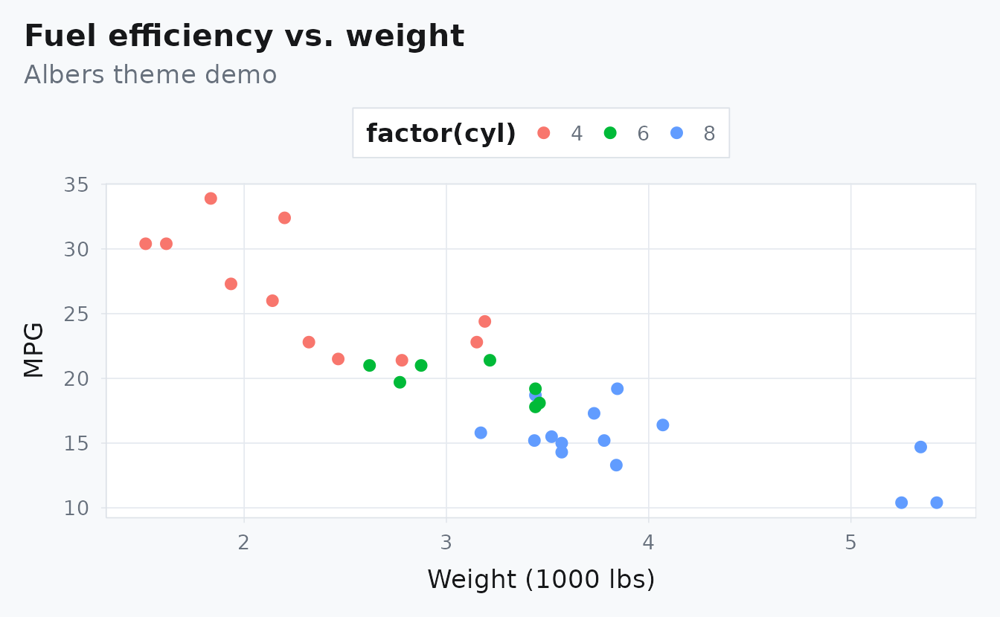

# Albersdown: Getting started

## Overview

This vignette shows how the shared theme and vignette CSS work together.
Links and focus rings use the family’s accessible tone; callouts and
stripes use a quiet tint.

## New feature highlights

- Design tokens + contrast guardrails: see
  [`vignette("design-notes")`](https://bbuchsbaum.github.io/albersdown/articles/design-notes.md),
  section `#whats-new` and `#contrast-guardrails`.
- Generative composition motif + semantic callouts: see
  [`vignette("design-notes")`](https://bbuchsbaum.github.io/albersdown/articles/design-notes.md),
  sections `#whats-new` and `#semantic-callouts`.
- Interactive visual tuning (family/preset/style/width): see
  [`vignette("theme-lab")`](https://bbuchsbaum.github.io/albersdown/articles/theme-lab.md).
- Dark + non-red accent gallery: see
  [`vignette("theme-showcase")`](https://bbuchsbaum.github.io/albersdown/articles/theme-showcase.md).

## Code + output

``` r
summary(mtcars$mpg)
#>    Min. 1st Qu.  Median    Mean 3rd Qu.    Max. 
#>   10.40   15.43   19.20   20.09   22.80   33.90
```

``` r
mtcars |>
  ggplot(aes(wt, mpg, color = factor(cyl))) +
  geom_point(size = 2.2) +
  labs(title = "Fuel efficiency vs. weight",
       subtitle = "Albers theme demo", x = "Weight (1000 lbs)", y = "MPG")
```


