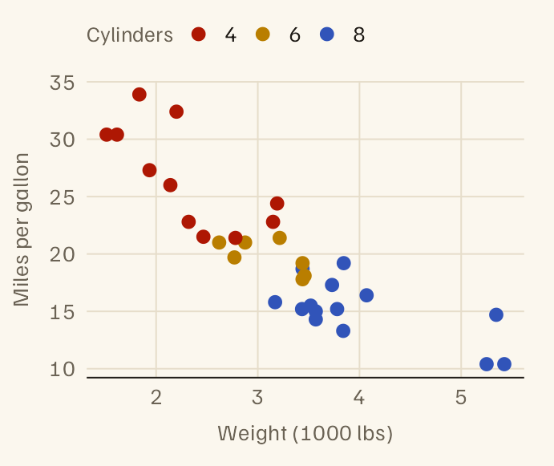
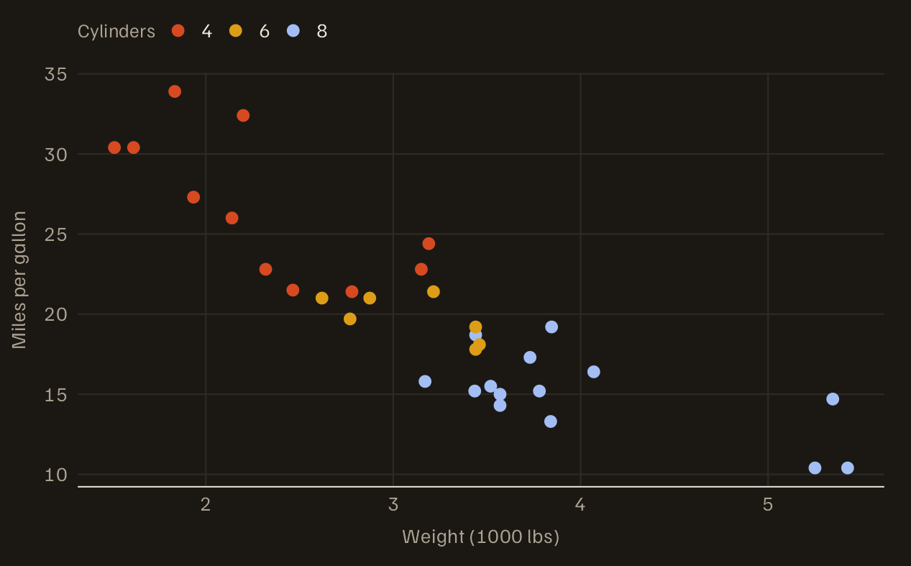
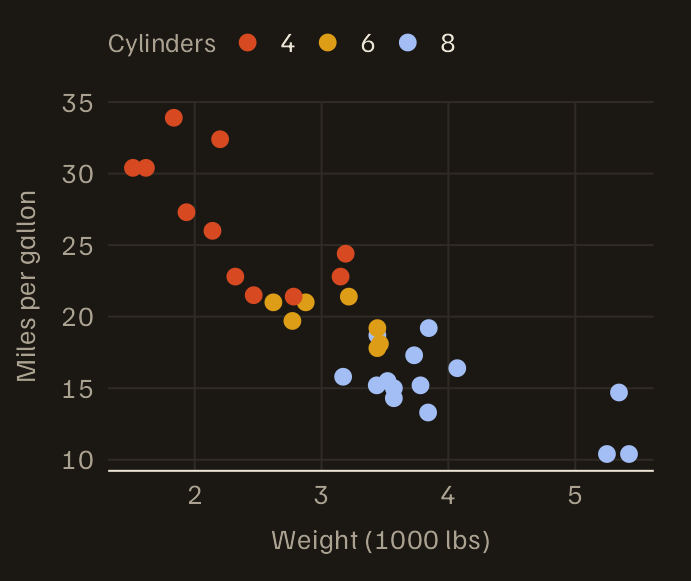

# Getting started

albersdown themes the two places R package documentation lives: CRAN
vignettes and pkgdown sites. This vignette is itself rendered with the
format it describes.

## A vignette

Set the output format in the vignette’s YAML header:

``` yaml
output:
  albersdown::albers_vignette:
    family: red        # red, lapis, ochre, teal, green, violet
    preset: homage     # homage (warm, serif) or interaction (cool, grotesk)
```

and declare the packages the vignette needs in `DESCRIPTION`:

    Suggests:
        albersdown (>= 2.1.0),
        knitr,
        rmarkdown
    VignetteBuilder: knitr

Nothing is copied into `vignettes/`. The stylesheet, the fonts for the
chosen direction and a small page script are embedded in the rendered
HTML, so the vignette makes no network requests (the kind of vignette
CRAN expects).

[`albers_vignette()`](https://bbuchsbaum.github.io/albersdown/reference/albers_vignette.md)
is new in albersdown 2.1.0, hence the version bound. If a vignette build
fails with
`'albers_vignette' is not an exported object from 'namespace:albersdown'`,
the albersdown being used is 2.0.0 or older (R does not enforce
`Suggests` versions when building): update it with
`install.packages("albersdown")`.

**Tip.** For an existing package, `use_albersdown(".", family = "teal")`
switches its `html_vignette` vignettes to the format and updates
`DESCRIPTION` (with the version bound; `Remotes` too if the installed
albersdown is a development version) and `_pkgdown.yml` for you; add
`dry_run = TRUE` to see the changes first. It also migrates a package
set up by albersdown 2.0.

## Code and output

Output sits in its own block under the code that produced it, and
warnings and errors are marked:

``` r

x <- c(4.2, 5.1, 6.3, 5.8)
summary(x)
#>    Min. 1st Qu.  Median    Mean 3rd Qu.    Max. 
#>   4.200   4.875   5.450   5.350   5.925   6.300
```

``` r

as.integer("seven")
#> ⁤Warning: NAs introduced by coercion
#> [1] NA
```

The copy button on each block copies the code without its output.

## Figures

While the vignette renders,
[`theme_albers()`](https://bbuchsbaum.github.io/albersdown/reference/theme_albers.md)
is the ggplot2 theme and the albersdown scales follow the vignette’s
family, so no `family` argument is needed:

``` r

ggplot(mtcars, aes(wt, mpg, colour = factor(cyl))) +
  geom_point(size = 2.4) +
  albersdown::scale_color_albers() +
  labs(x = "Weight (1000 lbs)", y = "Miles per gallon", colour = "Cylinders")
```



Heavier cars travel fewer miles per gallon.





Each ggplot that a chunk prints automatically is also rendered for the
dark theme, and readers in dark mode see that version. Set
`dark_figures = FALSE` in the format options to skip it. Base-graphics
plots take the page’s colours but have no dark version, nor do plots in
chunks with `fig.show = "hold"`, `"animate"` or `"hide"`.

## Tables

``` r

knitr::kable(
  aggregate(cbind(mpg, hp) ~ cyl, data = mtcars, FUN = mean),
  digits = 1,
  caption = "Mean fuel efficiency and power by cylinder count."
)
```

| cyl |  mpg |    hp |
|----:|-----:|------:|
|   4 | 26.7 |  82.6 |
|   6 | 19.7 | 122.3 |
|   8 | 15.1 | 209.2 |

Mean fuel efficiency and power by cylinder count. {.table}

Tables too wide for the text column can use the margin on large screens:
wrap the chunk in a `::: {.wide}` block.

## A pkgdown site

In `_pkgdown.yml`:

``` yaml
template:
  package: albersdown
  bootstrap: 5
```

and `Config/Needs/website: bbuchsbaum/albersdown` in `DESCRIPTION`. R
CMD check reads neither, so a CRAN package can theme its site this way
without changing its vignettes or dependencies;
`use_albersdown(".", apply_to = "new")` sets it up. Building the site
needs albersdown 2.1.0 or later (`Config/Needs/website` makes a pkgdown
CI workflow install it from GitHub); with albersdown 2.0.0, pkgdown
builds a plain Bootstrap site without an error. Articles written with
[`albers_vignette()`](https://bbuchsbaum.github.io/albersdown/reference/albers_vignette.md)
keep their own family and direction on the site.
