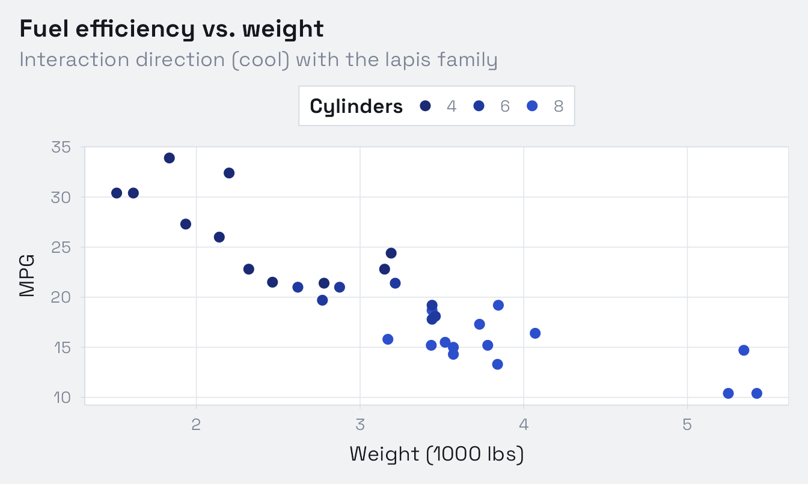

# Interaction: the cool direction

## Overview

This vignette is rendered in the **Interaction** direction: a cool grey
ground, all-grotesk type (Space Grotesk for display, Hanken Grotesk for
body), and dark code blocks. It is the counterpart to the warm, serif
**Homage** direction shown in
[`vignette("getting-started")`](https://bbuchsbaum.github.io/albersdown/articles/getting-started.md).
Switching is a one-line change – `preset: interaction` in the vignette
YAML, or `theme_albers(preset = "interaction")` for plots.

### How the two directions relate

A *direction* sets the ground, the type pairing, the code theme, and the
nested-square marker’s outer ring. The *family* (here `lapis`) still
drives the accent: links, the marker’s inner squares, and the plot
palette all follow it.

## Dark code blocks

Code is rendered on a dark panel with light syntax tokens, while inline
code like `neighbor_graph()` stays a light chip so it reads inside body
text.

``` r

m <- matrix(rnorm(40), 8, 5)
round(cor(m), 2)
#>       [,1]  [,2] [,3]  [,4]  [,5]
#> [1,]  1.00 -0.06 0.35  0.69  0.05
#> [2,] -0.06  1.00 0.23  0.24 -0.27
#> [3,]  0.35  0.23 1.00  0.60  0.19
#> [4,]  0.69  0.24 0.60  1.00 -0.41
#> [5,]  0.05 -0.27 0.19 -0.41  1.00
```

> TIP: The dark code block is part of the Interaction direction. In
> Homage the same block is a light cream panel – the syntax colours
> adapt to stay legible on either ground.

## Tables

``` r

knitr::kable(head(mtcars[, c("mpg", "wt", "hp", "cyl")]), caption = "A small table on the cool ground.")
```

|                   |  mpg |    wt |  hp | cyl |
|:------------------|-----:|------:|----:|----:|
| Mazda RX4         | 21.0 | 2.620 | 110 |   6 |
| Mazda RX4 Wag     | 21.0 | 2.875 | 110 |   6 |
| Datsun 710        | 22.8 | 2.320 |  93 |   4 |
| Hornet 4 Drive    | 21.4 | 3.215 | 110 |   6 |
| Hornet Sportabout | 18.7 | 3.440 | 175 |   8 |
| Valiant           | 18.1 | 3.460 | 105 |   6 |

A small table on the cool ground. {.table}

## A plot on the matching ground

The plot’s background is the same cool grey as the page, so the figure
sits seamlessly in the article rather than floating on a mismatched
panel.

``` r

mtcars |>
  ggplot(aes(wt, mpg, color = factor(cyl))) +
  geom_point(size = 2.4) +
  albersdown::scale_color_albers(family = params$family) +
  labs(
    title = "Fuel efficiency vs. weight",
    subtitle = "Interaction direction (cool) with the lapis family",
    x = "Weight (1000 lbs)", y = "MPG", color = "Cylinders"
  )
```


