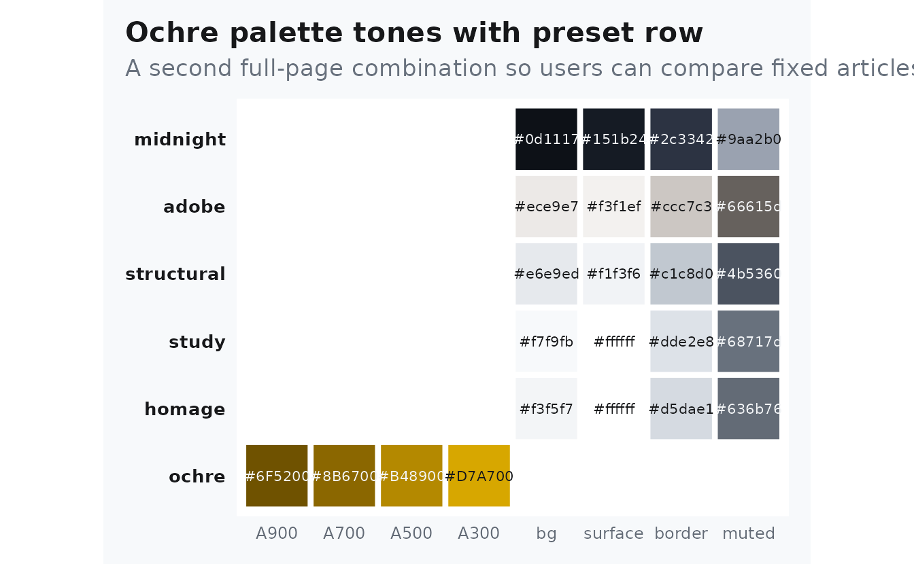
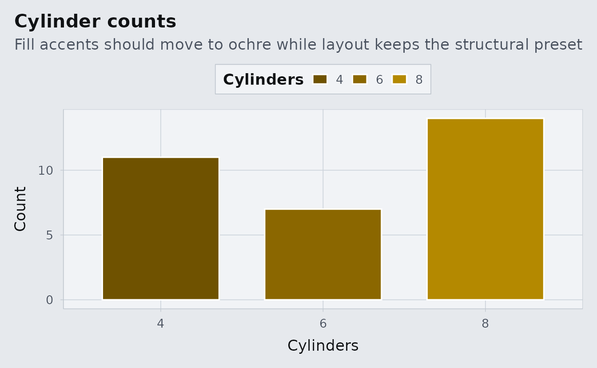

# Theme Proof: Ochre + Structural

## What To Look For

This proof page fixes the article to `ochre` plus `structural`. The
family should show up in links, section dividers, plot highlights, and
emphasis bands.

The preset should feel more architectural than `study`: harder surfaces,
flatter shadows, and a drier ground color behind the same typography and
layout system.

## Palette Evidence

``` r
albersdown::albers_swatch(families = params$family, show_presets = TRUE) +
  ggplot2::labs(
    title = "Ochre palette tones with preset row",
    subtitle = "A second full-page combination so users can compare fixed articles directly"
  ) +
  ggplot2::theme(legend.position = "none")
```



## Plot Evidence

``` r
counts <- as.data.frame(table(mtcars$cyl))
names(counts) <- c("cyl", "n")

ggplot(counts, aes(cyl, n, fill = cyl)) +
  geom_col(width = 0.72, color = "white") +
  albersdown::scale_fill_albers(family = params$family) +
  labs(
    title = "Cylinder counts",
    subtitle = "Fill accents should move to ochre while layout keeps the structural preset",
    x = "Cylinders",
    y = "Count",
    fill = "Cylinders"
  )
```



## Table Evidence

``` r
knitr::kable(
  aggregate(cbind(mpg, wt, hp) ~ cyl, data = mtcars, FUN = mean),
  digits = 1,
  caption = "Grouped summary to inspect borders, spacing, and the overall preset mood."
)
```

| cyl |  mpg |  wt |    hp |
|----:|-----:|----:|------:|
|   4 | 26.7 | 2.3 |  82.6 |
|   6 | 19.7 | 3.1 | 122.3 |
|   8 | 15.1 | 4.0 | 209.2 |

Grouped summary to inspect borders, spacing, and the overall preset
mood.
