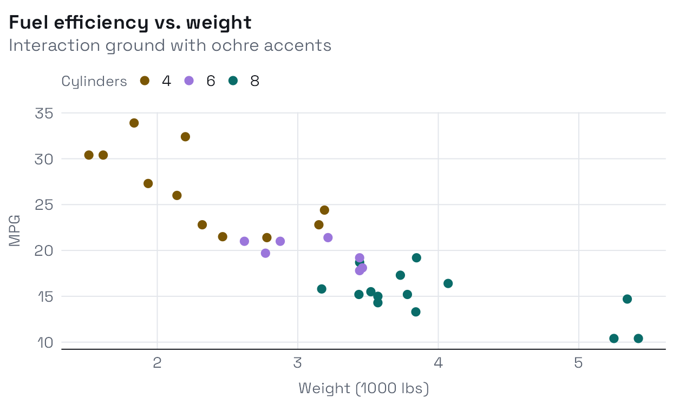
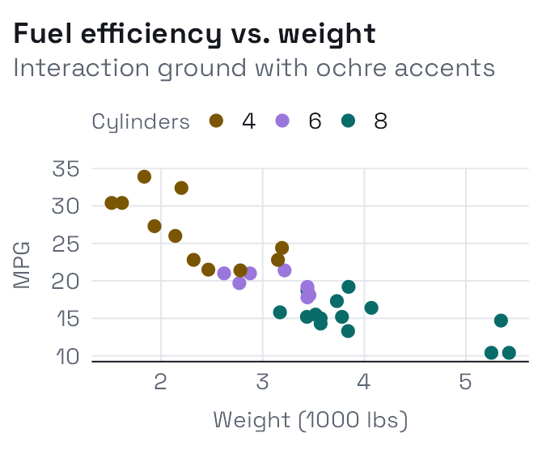
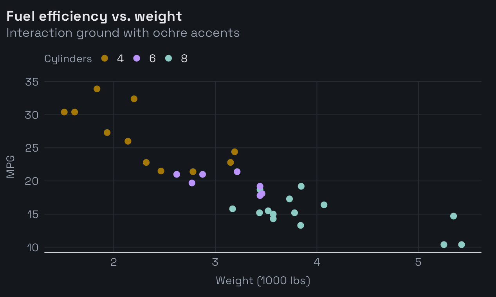
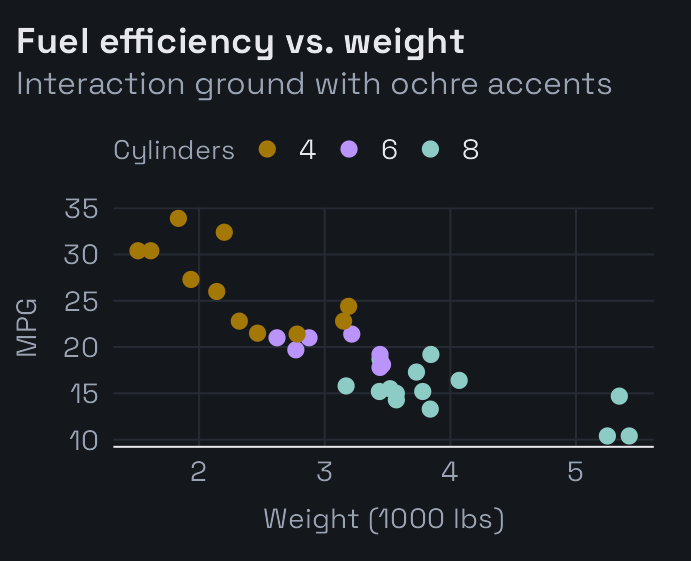

# Theme Proof: Interaction + Ochre

## What this page proves

This is a full page in the **Interaction** direction (cool grey ground,
grotesk type, dark code blocks) with the **ochre** family. The same dark
code panel and cool ground as
[`vignette("interaction")`](https://bbuchsbaum.github.io/albersdown/articles/interaction.md),
but the accents — links, the nested-square marker, the syntax-accent
rule, and the plot palette — are ochre rather than lapis. Direction sets
the mood; family sets the hue.

> TIP: On the dark code ground, the syntax token colours adapt
> automatically so code stays legible regardless of the family.

## Code on a dark ground

``` r

albersdown::albers_palette("ochre")
#>      A900      A700      A500      A300 
#> "#513801" "#7A5604" "#A47807" "#DEB95C"
```

Inline code such as `theme_albers(preset = "interaction")` stays a light
chip so it reads inside the body text.

## A table

``` r

knitr::kable(
  head(mtcars[, c("mpg", "wt", "hp", "cyl")]),
  caption = "Ochre accents on the table header rule, cool ground."
)
```

|                   |  mpg |    wt |  hp | cyl |
|:------------------|-----:|------:|----:|----:|
| Mazda RX4         | 21.0 | 2.620 | 110 |   6 |
| Mazda RX4 Wag     | 21.0 | 2.875 | 110 |   6 |
| Datsun 710        | 22.8 | 2.320 |  93 |   4 |
| Hornet 4 Drive    | 21.4 | 3.215 | 110 |   6 |
| Hornet Sportabout | 18.7 | 3.440 | 175 |   8 |
| Valiant           | 18.1 | 3.460 | 105 |   6 |

Ochre accents on the table header rule, cool ground. {.table}

## A plot on the matching ground

``` r

ggplot(mtcars, aes(wt, mpg, colour = factor(cyl))) +
  geom_point(size = 2.3) +
  albersdown::scale_color_albers() +
  labs(
    title = "Fuel efficiency vs. weight",
    subtitle = "Interaction ground with ochre accents",
    x = "Weight (1000 lbs)", y = "MPG", colour = "Cylinders"
  )
```






