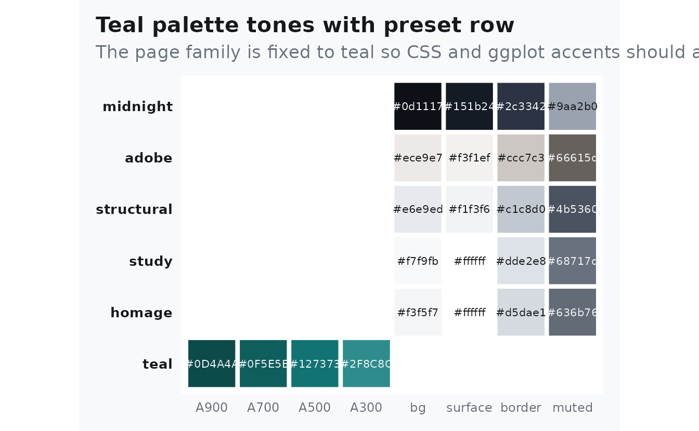
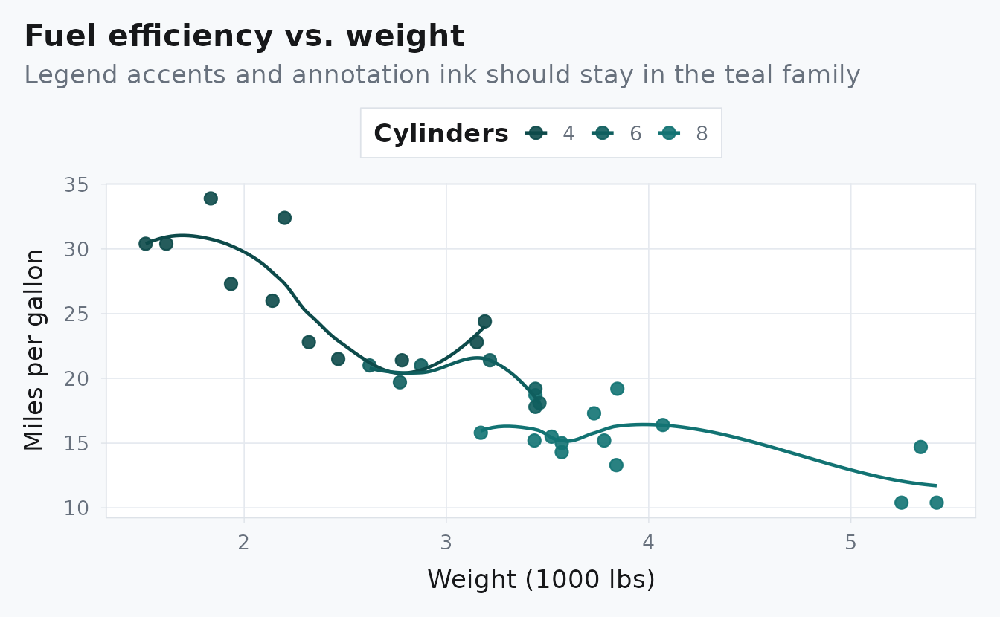

# Theme Proof: Teal + Study

## Why This Page Exists

This page is a direct proof vignette: it fixes the family at `teal` and
the preset at `study` so readers can inspect a full article instead of a
matrix or control panel.

The accent should read as teal in links, rules, callouts, and plotted
highlights. For a quick contrast check, compare this page against
[pkgdown](https://pkgdown.r-lib.org/).

> The point is not variety inside one page. The point is one stable
> combination rendered end to end.

## Palette Evidence

``` r
albersdown::albers_swatch(families = params$family, show_presets = TRUE) +
  ggplot2::labs(
    title = "Teal palette tones with preset row",
    subtitle = "The page family is fixed to teal so CSS and ggplot accents should agree"
  ) +
  ggplot2::theme(legend.position = "none")
```



## Plot Evidence

``` r
mtcars |>
  transform(cyl = factor(cyl)) |>
  ggplot(aes(wt, mpg, color = cyl)) +
  geom_point(size = 2.6, alpha = 0.9) +
  geom_smooth(se = FALSE, linewidth = 0.8) +
  albersdown::scale_color_albers(family = params$family) +
  labs(
    title = "Fuel efficiency vs. weight",
    subtitle = "Legend accents and annotation ink should stay in the teal family",
    x = "Weight (1000 lbs)",
    y = "Miles per gallon",
    color = "Cylinders"
  )
```



## Table Evidence

``` r
knitr::kable(
  head(mtcars[, c("mpg", "wt", "hp", "qsec")], 6),
  digits = 1,
  caption = "A simple table to inspect rules, spacing, and code-adjacent typography."
)
```

|                   |  mpg |  wt |  hp | qsec |
|:------------------|-----:|----:|----:|-----:|
| Mazda RX4         | 21.0 | 2.6 | 110 | 16.5 |
| Mazda RX4 Wag     | 21.0 | 2.9 | 110 | 17.0 |
| Datsun 710        | 22.8 | 2.3 |  93 | 18.6 |
| Hornet 4 Drive    | 21.4 | 3.2 | 110 | 19.4 |
| Hornet Sportabout | 18.7 | 3.4 | 175 | 17.0 |
| Valiant           | 18.1 | 3.5 | 105 | 20.2 |

A simple table to inspect rules, spacing, and code-adjacent typography.
