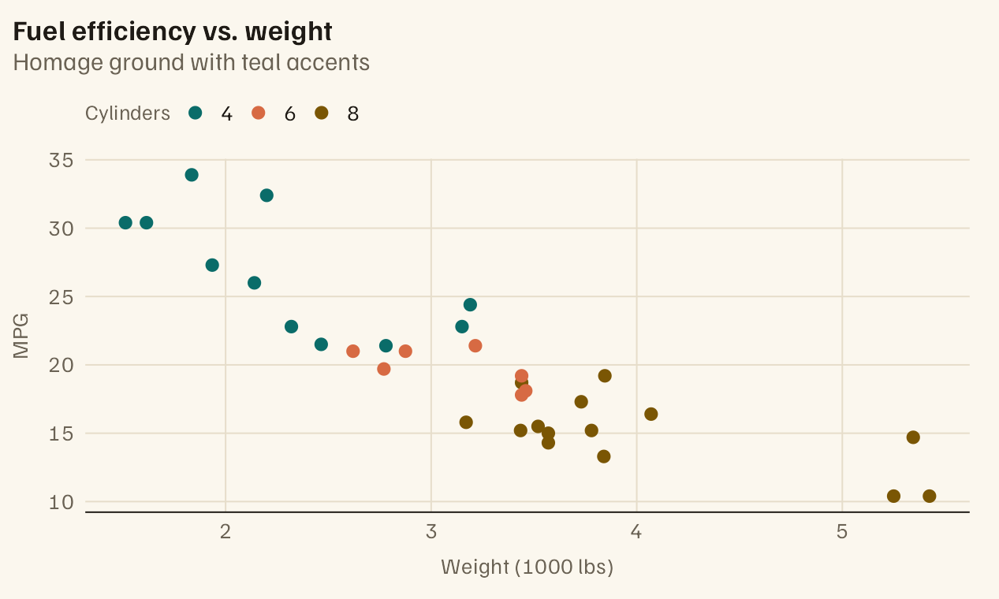

# Theme Proof: Homage + Teal

## What this page proves

This is a full page in the **Homage** direction (warm cream ground,
Newsreader serif body, light code) with the **teal** family. The accents
— links, the nested-square marker, the code rule, and the plot palette —
all shift to teal while the warm ground and serif type stay put. Compare
it against
[`vignette("getting-started")`](https://bbuchsbaum.github.io/albersdown/articles/getting-started.md)
(homage + red) to see the family swap in isolation.

> TIP: A direction and a family are independent. Keep the direction for
> mood, change the family for accent character.

## Code on a light ground

``` r

albersdown::albers_palette("teal")
#>      A900      A700      A500      A300 
#> "#0D4A4A" "#0F5E5E" "#127373" "#2F8C8C"
```

Inline tokens like
[`theme_albers()`](https://bbuchsbaum.github.io/albersdown/reference/theme_albers.md)
and
[`scale_color_albers()`](https://bbuchsbaum.github.io/albersdown/reference/scale_color_albers.md)
stay legible against the warm surface.

## A table

``` r

knitr::kable(
  head(mtcars[, c("mpg", "wt", "hp", "cyl")]),
  caption = "Teal accents on the table header rule."
)
```

|                   |  mpg |    wt |  hp | cyl |
|:------------------|-----:|------:|----:|----:|
| Mazda RX4         | 21.0 | 2.620 | 110 |   6 |
| Mazda RX4 Wag     | 21.0 | 2.875 | 110 |   6 |
| Datsun 710        | 22.8 | 2.320 |  93 |   4 |
| Hornet 4 Drive    | 21.4 | 3.215 | 110 |   6 |
| Hornet Sportabout | 18.7 | 3.440 | 175 |   8 |
| Valiant           | 18.1 | 3.460 | 105 |   6 |

Teal accents on the table header rule. {.table}

## A plot on the matching ground

``` r

ggplot(mtcars, aes(wt, mpg, colour = factor(cyl))) +
  geom_point(size = 2.3) +
  albersdown::scale_color_albers(family = params$family) +
  labs(
    title = "Fuel efficiency vs. weight",
    subtitle = "Homage ground with teal accents",
    x = "Weight (1000 lbs)", y = "MPG", colour = "Cylinders"
  )
```


