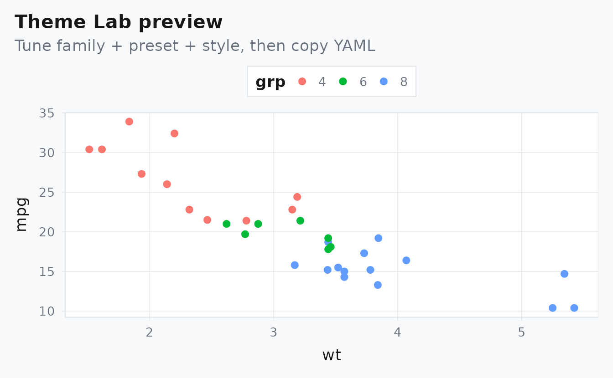

# Theme Lab: Tune Family, Preset, and Rhythm

## What Is This Page For?

Use this page to choose a visual direction before you retrofit or create
vignettes. You can tune one parameter at a time and immediately see the
effect on hierarchy, contrast, and page rhythm.

Start with **family** and **preset**, then tune **style**, then adjust
content width. That order gives the fastest path to a coherent page.

## How Do You Use It?

1.  Pick a family for color character.
2.  Pick a preset for ground/surface mood.
3.  Toggle style intensity to set structural emphasis.
4.  Adjust content width to match prose density.

    <div class="theme-lab__controls">
      <div>
        <label for="albers-family">Family</label>
        <select id="albers-family" data-albers-control="family">
          <option value="red">red</option>
          <option value="lapis">lapis</option>
          <option value="ochre">ochre</option>
          <option value="teal">teal</option>
          <option value="green">green</option>
          <option value="violet">violet</option>
        </select>
      </div>
      <div>
        <label for="albers-preset">Preset</label>
        <select id="albers-preset" data-albers-control="preset">
          <option value="study">study</option>
          <option value="structural">structural</option>
          <option value="adobe">adobe</option>
          <option value="midnight">midnight</option>
        </select>
      </div>
      <div>
        <label for="albers-style">Style</label>
        <select id="albers-style" data-albers-control="style">
          <option value="minimal">minimal</option>
          <option value="balanced">balanced</option>
          <option value="assertive">assertive</option>
        </select>
      </div>
      <div>
        <label for="albers-width">Content width (ch)</label>
        <input id="albers-width" data-albers-control="width" type="number" min="60" max="100" value="80" />
      </div>
    </div>

    <div class="theme-lab__chips">
      <span class="albers-chip">A900</span>
      <span class="albers-chip">A700</span>
      <span class="albers-chip">A500</span>
      <span class="albers-chip">A300</span>
    </div>
    <p data-albers-lab-summary>family=red | preset=study | style=minimal | width=80ch</p>
    <div class="albers-composition albers-composition--dense" data-seed="theme-lab" data-density="8" aria-hidden="true"></div>

## What Does Each Control Change?

- `family`: accent hue and contrast character for links, rules, and
  highlights.
- `preset`: background/surface/ink system (light analytical to dark
  editorial).
- `style`: structural weight (`minimal`, `balanced`, `assertive`).
- `content_width`: reading measure in `ch` units.

## Can You Validate The Palette Quickly?

``` r
pal <- albersdown::albers_palette(params$family)
stopifnot(
  identical(names(pal), c("A900", "A700", "A500", "A300")),
  all(nzchar(unname(pal)))
)
knitr::kable(data.frame(tone = names(pal), hex = unname(pal)), format = "html")
```

| tone | hex      |
|:-----|:---------|
| A900 | \#C22B23 |
| A700 | \#DC3925 |
| A500 | \#E44926 |
| A300 | \#E35B2D |

## Copy Into YAML

``` yaml
params:
  family: red
  preset: study
  base_size: 13
  content_width: 80
  style: minimal
```

## Example Plot

``` r
mtcars$grp <- factor(mtcars$cyl)
stopifnot(length(levels(mtcars$grp)) >= 3)

ggplot(mtcars, aes(wt, mpg, colour = grp)) +
  geom_point(size = 2.2) +
  labs(
    title = "Theme Lab preview",
    subtitle = "Tune family + preset + style, then copy YAML"
  )
```


