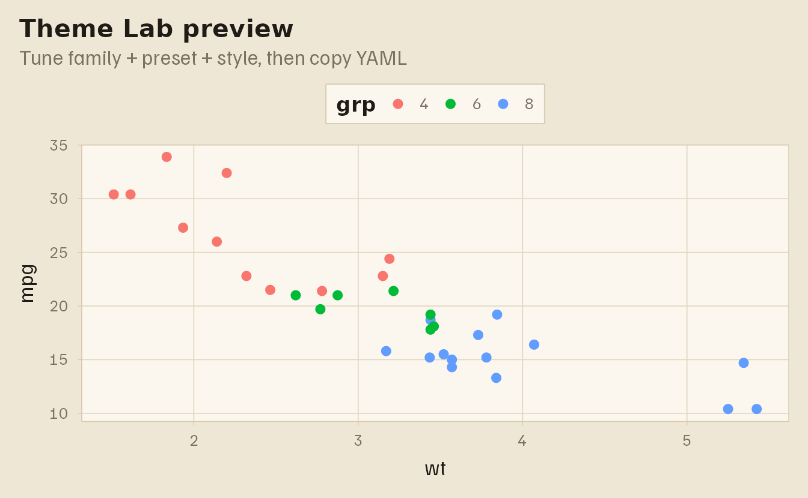
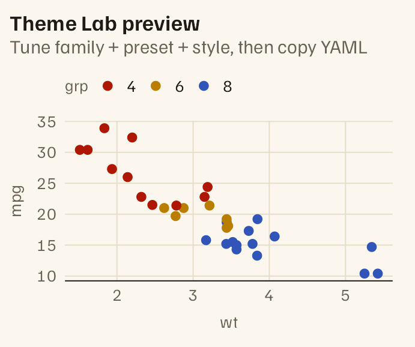
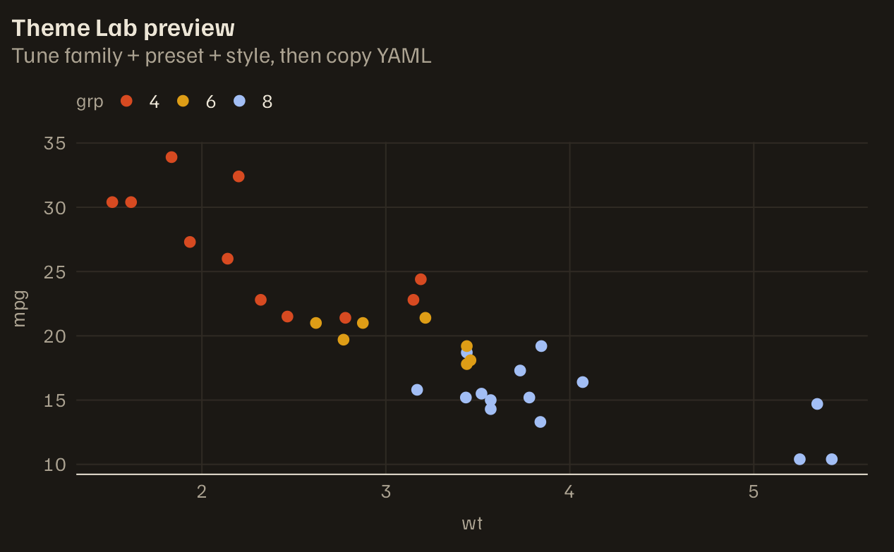
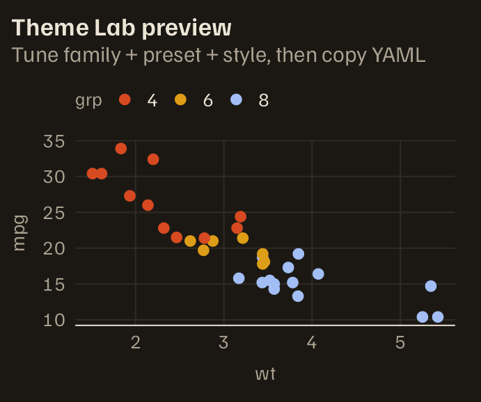

# Theme Lab: Tune Family, Preset, and Rhythm

## What Is This Page For?

Use this page to choose a visual direction before you retrofit or create
vignettes. You can tune one parameter at a time and immediately see the
effect on hierarchy, contrast, and page rhythm.

Start with **family** and **preset**, then tune **style**, then adjust
content width. That order gives the fastest path to a coherent page.

## How Do You Use It?

1.  Pick a family for color character (the four chips show its tones).
2.  Pick a direction: warm **homage** or cool **interaction**.
3.  Toggle style intensity to set structural emphasis (marker + rule
    weight).
4.  Adjust content width to match prose density.

Family red lapis ochre teal green violet

Direction homage (warm) interaction (cool)

Style minimal balanced assertive

Content width (ch)

A900 A700 A500 A300

family=red \| preset=homage \| style=minimal \| width=66ch

## What Does Each Control Change?

- `family`: accent hue and contrast character for links, rules, the
  nested-square marker, and plot palettes (the four chips above show the
  active family’s tones).
- `preset` (direction): warm **homage** (cream ground, serif body, light
  code) vs cool **interaction** (grey ground, grotesk, dark code).
- `style`: structural weight (`minimal` or `assertive`).
- Content width: the reading measure in `ch` units, for this preview
  only. The theme sets it (66ch in homage, 64ch in interaction); it is
  not a format option.

## Can You Validate The Palette Quickly?

``` r

# the format sets the albersdown.family option to the vignette's family
pal <- albersdown::albers_palette(getOption("albersdown.family", "red"))
stopifnot(
  identical(names(pal), c("A900", "A700", "A500", "A300")),
  all(nzchar(unname(pal)))
)
knitr::kable(data.frame(tone = names(pal), hex = unname(pal)), format = "html")
```

| tone | hex      |
|:-----|:---------|
| A900 | \#760906 |
| A700 | \#AE1703 |
| A500 | \#D74A21 |
| A300 | \#F7A885 |

## Copy Into YAML

Put the choice in the vignette’s output format:

``` yaml
output:
  albersdown::albers_vignette:
    family: red        # red, lapis, ochre, teal, green, violet
    preset: homage     # homage or interaction
    style: minimal     # minimal, balanced or assertive
```

## Example Plot

``` r

mtcars$grp <- factor(mtcars$cyl)
stopifnot(length(levels(mtcars$grp)) >= 3)

ggplot(mtcars, aes(wt, mpg, colour = grp)) +
  geom_point(size = 2.2) +
  albersdown::scale_color_albers() +
  labs(
    title = "Theme Lab preview",
    subtitle = "Tune family + preset + style, then copy YAML"
  )
```






