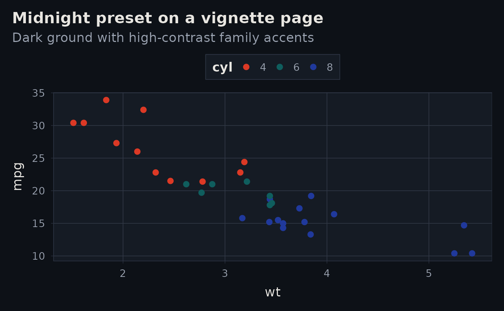
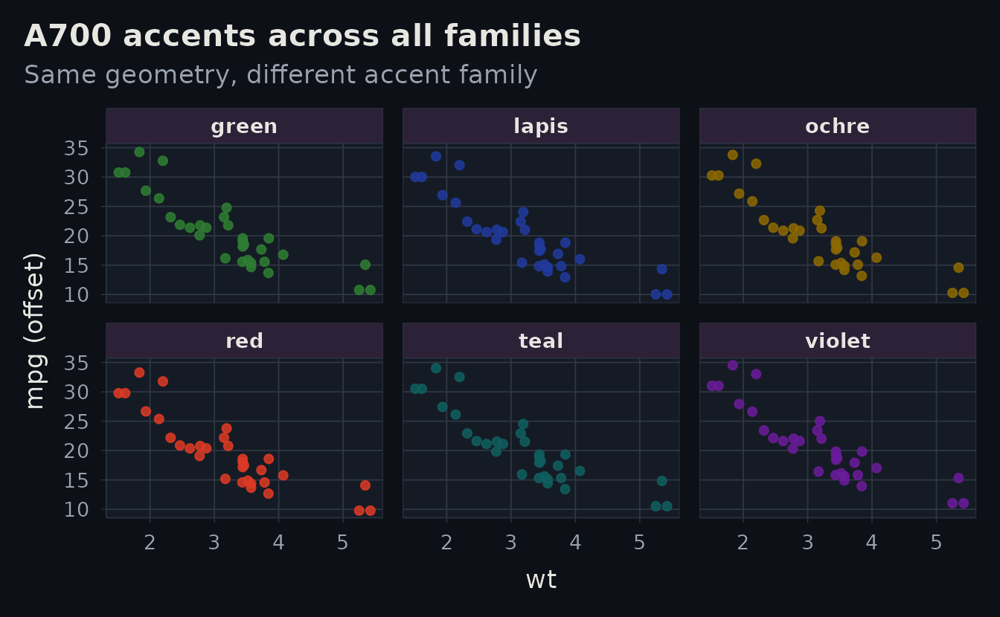

# Theme Showcase: Dark + Accent Families

## Why this vignette?

This page is a dedicated showcase for combinations that intentionally
depart from the default light red look:

- dark ground (`preset: midnight`)
- alternate accent families (`lapis`, `ochre`, `teal`, `green`,
  `violet`)

## Midnight page, production-style plot

``` r
ggplot(mtcars, aes(wt, mpg, colour = factor(cyl))) +
  geom_point(size = 2.2) +
  albersdown::scale_color_albers_distinct() +
  labs(
    title = "Midnight preset on a vignette page",
    subtitle = "Dark ground with high-contrast family accents",
    colour = "cyl"
  )
```



## Accent family comparison

``` r
families <- c("red", "lapis", "ochre", "teal", "green", "violet")
accent_a700 <- vapply(families, function(f) albersdown::albers_palette(f)[["A700"]], character(1))

plot_df <- do.call(rbind, lapply(seq_along(families), function(i) {
  d <- mtcars
  d$family <- families[[i]]
  d$mpg_offset <- d$mpg + (i - (length(families) + 1) / 2) * 0.25
  d
}))

ggplot(plot_df, aes(wt, mpg_offset, colour = family)) +
  geom_point(alpha = 0.85, size = 1.7) +
  facet_wrap(~family, ncol = 3) +
  scale_color_manual(values = accent_a700) +
  labs(
    title = "A700 accents across all families",
    subtitle = "Same geometry, different accent family",
    x = "wt",
    y = "mpg (offset)"
  ) +
  theme(legend.position = "none")
```



## Copy-ready presets

``` r
recipes <- data.frame(
  profile = c("dark-violet-minimal", "dark-lapis-minimal", "dark-teal-assertive"),
  family = c("violet", "lapis", "teal"),
  preset = c("midnight", "midnight", "midnight"),
  style = c("minimal", "minimal", "assertive"),
  stringsAsFactors = FALSE
)
knitr::kable(recipes, format = "html")
```

| profile             | family | preset   | style     |
|:--------------------|:-------|:---------|:----------|
| dark-violet-minimal | violet | midnight | minimal   |
| dark-lapis-minimal  | lapis  | midnight | minimal   |
| dark-teal-assertive | teal   | midnight | assertive |

## Next step

- Use
  [`vignette("theme-lab")`](https://bbuchsbaum.github.io/albersdown/articles/theme-lab.md)
  for interactive tuning.
- Keep
  [`vignette("getting-started")`](https://bbuchsbaum.github.io/albersdown/articles/getting-started.md)
  and
  [`vignette("design-notes")`](https://bbuchsbaum.github.io/albersdown/articles/design-notes.md)
  on the default light red presentation for baseline docs clarity.
