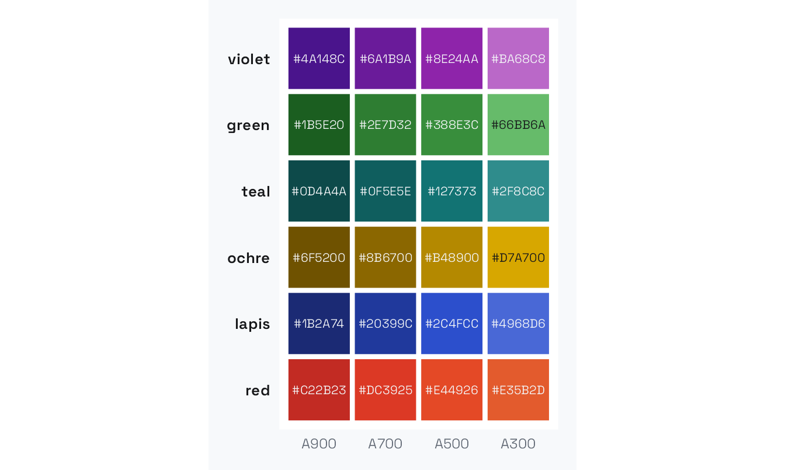
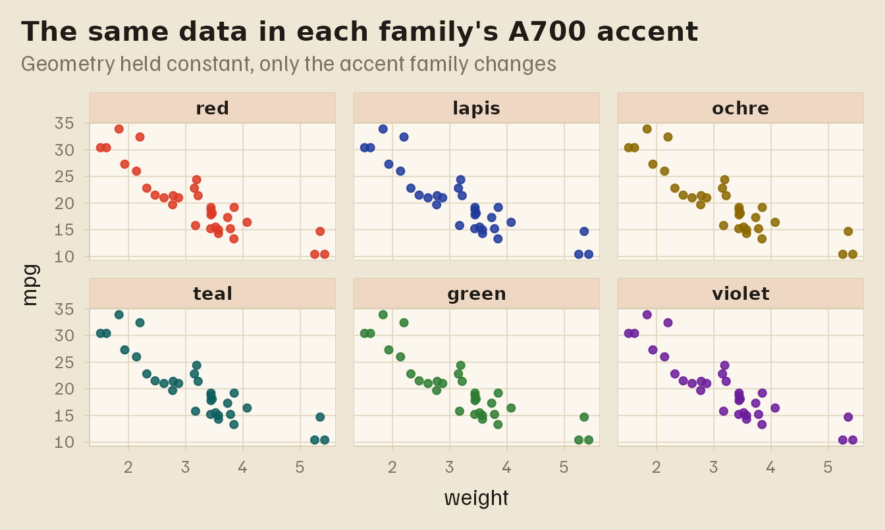
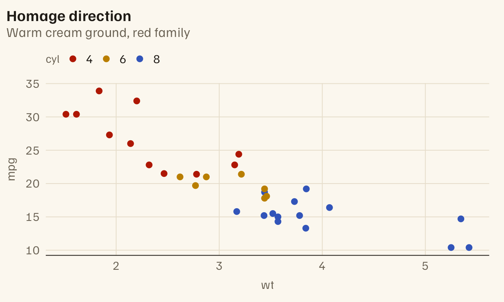
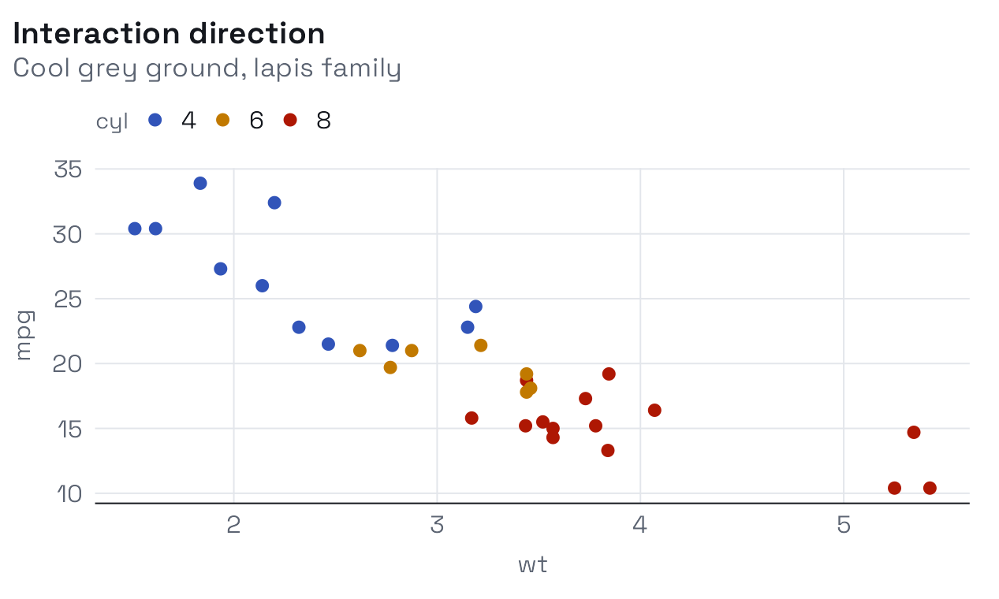

# Theme Showcase: Directions and Families

## The albersdown system

albersdown has two orthogonal axes:

- A **direction** sets the page mood: **homage** (warm cream ground,
  Newsreader serif body, light code blocks) or **interaction** (cool
  grey ground, all-grotesk type, dark code blocks).
- A **family** sets the accent hue used for links, the nested-square
  marker, and plot palettes: `red`, `lapis`, `ochre`, `teal`, `green`,
  or `violet`.

Any family pairs with either direction. This page is rendered in
**homage + red**;
[`vignette("getting-started")`](https://bbuchsbaum.github.io/albersdown/articles/getting-started.md)
shows homage and
[`vignette("interaction")`](https://bbuchsbaum.github.io/albersdown/articles/interaction.md)
shows the cool direction in full.

## The six families

Each family is a four-tone ramp (A900 → A300). The marker, links, and
plot scales all draw from the active family.

``` r

albersdown::albers_swatch(c("red", "lapis", "ochre", "teal", "green", "violet"))
```



``` r

families <- c("red", "lapis", "ochre", "teal", "green", "violet")
accent_a700 <- vapply(families, function(f) albersdown::albers_palette(f)[["A700"]], character(1))

plot_df <- do.call(rbind, lapply(seq_along(families), function(i) {
  d <- mtcars
  d$family <- families[[i]]
  d
}))
plot_df$family <- factor(plot_df$family, levels = families)

ggplot(plot_df, aes(wt, mpg, colour = family)) +
  geom_point(alpha = 0.85, size = 1.7) +
  facet_wrap(~family, ncol = 3) +
  scale_color_manual(values = accent_a700) +
  labs(
    title = "The same data in each family's A700 accent",
    subtitle = "Geometry held constant, only the accent family changes",
    x = "weight", y = "mpg"
  ) +
  theme(legend.position = "none")
```



## The two directions, in plots

[`theme_albers()`](https://bbuchsbaum.github.io/albersdown/reference/theme_albers.md)
grounds a plot in the direction you pass, so a figure always sits on the
same surface as its page — warm cream for homage, cool grey for
interaction.

``` r

ggplot(mtcars, aes(wt, mpg, colour = factor(cyl))) +
  geom_point(size = 2.2) +
  albersdown::scale_color_albers(family = "red") +
  labs(title = "Homage direction", subtitle = "Warm cream ground, red family", colour = "cyl") +
  albersdown::theme_albers(family = "red", preset = "homage")
```



``` r

ggplot(mtcars, aes(wt, mpg, colour = factor(cyl))) +
  geom_point(size = 2.2) +
  albersdown::scale_color_albers(family = "lapis") +
  labs(title = "Interaction direction", subtitle = "Cool grey ground, lapis family", colour = "cyl") +
  albersdown::theme_albers(family = "lapis", preset = "interaction")
```



## Picking a combination

``` r

recipes <- data.frame(
  profile = c("homage-red", "homage-teal", "interaction-lapis", "interaction-ochre"),
  family = c("red", "teal", "lapis", "ochre"),
  direction = c("homage", "homage", "interaction", "interaction"),
  mood = c("warm, classic", "warm, calm", "cool, technical", "cool, earthy"),
  stringsAsFactors = FALSE
)
knitr::kable(recipes, format = "html", caption = "A few coherent direction + family pairings.")
```

| profile           | family | direction   | mood            |
|:------------------|:-------|:------------|:----------------|
| homage-red        | red    | homage      | warm, classic   |
| homage-teal       | teal   | homage      | warm, calm      |
| interaction-lapis | lapis  | interaction | cool, technical |
| interaction-ochre | ochre  | interaction | cool, earthy    |

A few coherent direction + family pairings. {.table}

## Next step

- Use
  [`vignette("theme-lab")`](https://bbuchsbaum.github.io/albersdown/articles/theme-lab.md)
  to tune family, direction, style, and width interactively.
- See
  [`vignette("getting-started")`](https://bbuchsbaum.github.io/albersdown/articles/getting-started.md)
  (homage) and
  [`vignette("interaction")`](https://bbuchsbaum.github.io/albersdown/articles/interaction.md)
  (interaction) for full-page examples of each direction.
